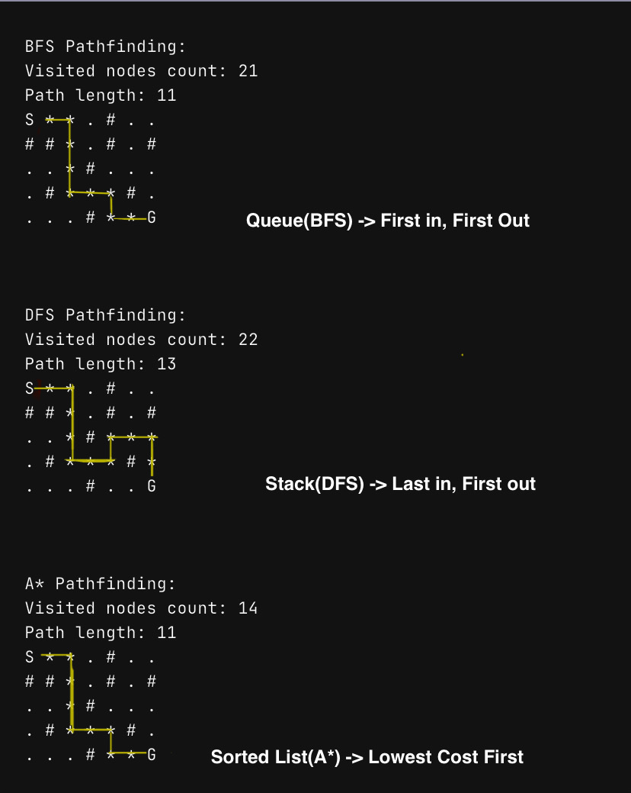

# Grid Pathfinder — BFS, DFS, and A*



I built this to understand how pathfinding algorithms actually work. The idea is simple: you have a grid with a start point, a goal, and some walls. The algorithm has to find a path from start to goal without walking through walls.

I implemented three different approaches and compared them:
- **BFS (Breadth-First Search)** — checks every possible path layer by layer. Slow but always finds the shortest one.
- **DFS (Depth-First Search)** — goes as deep as it can before backtracking. Fast sometimes, but the path it finds is usually longer than it needs to be.
- **A\* Search** — the smart one. Uses a heuristic (Manhattan distance) to guide the search toward the goal instead of blindly exploring. Finds the shortest path while checking way fewer cells.

## Results

| Algorithm | Cells Checked | Path Length | Shortest Path? |
|-----------|--------------|-------------|---------------|
| BFS | 21 | 11 | Yes |
| DFS | 22 | 13 | No |
| A* | 14 | 11 | Yes |

A* checked only 14 cells and still found the optimal path. DFS checked more cells and found a longer path. That's the difference a good heuristic makes.

## How the grid looks

```
S . . # . .
. # . # . .
. # . . . #
. . # # . .
# . . . # .
. . # . . G
```

- `S` = start, `G` = goal, `#` = wall, `*` = path the algorithm found, `.` = open space

## How to run it

I built this on my phone using a cloud Python environment (no laptop). You can run it the same way:

1. Open [Google Colab](https://colab.research.google.com/) or any Python environment
2. Paste the code from `pathfinding.py`
3. Run it

No external libraries needed — just standard Python.

## What I learned

- BFS guarantees shortest path but wastes time checking cells that are obviously going the wrong way
- DFS is unpredictable — sometimes it gets lucky, usually it doesn't
- A* is the one you'd actually use in a real application (GPS, games, robotics)
- You don't need a fancy computer to learn algorithms — a phone works fine
